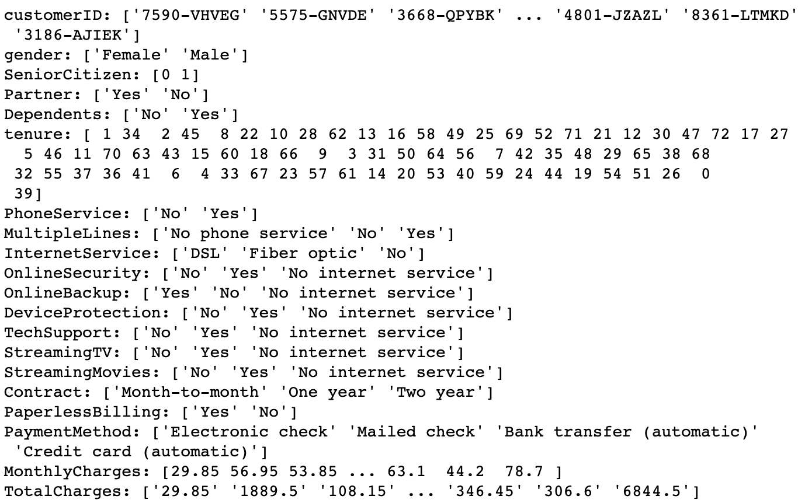
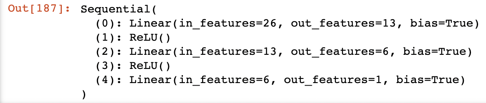

# Customer Churn Prediction for Telco Kaggle dataset.
Below I offer an executive summary of how I achieved a prediction accuracy of `91.30%` on the [Telco Customer Churn](https://www.kaggle.com/blastchar/telco-customer-churn) dataset available on Kaggle. Please follow the markdown cells in my notebook to understand my thought process in depth while I tackled this dataset. 

## Our Features
  
## The Target
  
## The libraries
Please run `conda env create -f environment.yml` from this repositories root directory to install all required libraries.  Summarizing, the primary ones are: `pytorch`, `imblearn`, `sklearn` & `pandas`.  

## The Model

## The hyper-parameters
The loss function (criterion): `nn.BCEWithLogitsLoss()`.  
The optimizer and learning rate: `optim.Adam(deeper_model.parameters(), lr=1e-2)`.   
Validation set size: `20%`.  
The number of epochs: `1000`. 

## Two custom functions
`print_unique()` and `training_loop()`, both of which may be found in my notebook.